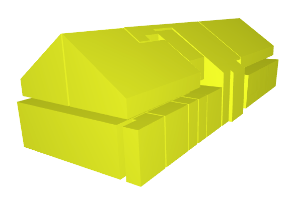

# T3D PointCloud Processing

This repository contains methods for the **automatic detection of rooms in interior PointClouds**. The methods can serve as inspiration, or can be applied as-is.



---

## Project Goal

The goal of this project is to automatically detect rooms in interior point clouds. One of the main challenges in working with interior 3D point cloud data is detecting walls and defining a room boundaries.

This repository contains a five-staged pipeline that preprocesses, split into floors, detects rooms, reconstructs the surface, and computes volume and area

For a quick dive into this repository take a look at our [Complete Pipeline](ipcp/notebooks/Complete%20Pipeline.ipynb).

---

## Folder Structure

 * [`ipcp`](./ipcp)
   * [`datasets`](./ipcp/datasets) _Example datasets of interior pointclouds_
   * [`notebooks`](./ipcp/notebooks) _Jupyter notebook tutorials_
   * [`src`](./ipcp/src) _Python source code_
     * [`utils`](./ipcp/src/utils) _Utility functions_
   * [`modules`](./ipcp/modules) _Pipeline modules_
   * [`cpp_modules`](./ipcp/cpp_modules) _Pipeline C++ modules_
   * [`preprocessors`](./ipcp/preprocessors) _Pre-processor modules_

---

## Dataset

The sample pointcloud provided is a subsampled version of the "Apartment, merged & resampled" from the [Redwood Indoor Lidar-RGBD Scan Dataset](http://redwood-data.org/indoor_lidar_rgbd/download.html). When using this dataset, please cite the [original source](http://redwood-data.org/indoor_lidar_rgbd/license.html):
 > Jaesik Park, Qian-Yi Zhou and Vladlen Koltun, _Colored Point Cloud Registration Revisited_. ICCV, 2017.

---

## Installation

There are two ways for using this repository. The easiest and recommended way is to build and use the provided docker image (see instructions below). Option 2 is to build to pipeline from scratch for OS of preference.

### Option 1: Docker-image

1. Clone this repository

2. Build docker image (the building can take a couple of minutes):
    ```bash
    docker build -f Dockerfile . -t t3d_docker:latest
    ```

3. Run docker container (as jupyter server on port 8888):
    ```bash
    docker run -v `pwd`/ipcp:/usr/app/ipcp -it -p 8888:8888 t3d_docker:latest
    ```

4. Check out the [notebooks](notebooks) in jupter on port 8888 for a demonstration.

### Option 2: Build from scratch

1. Clone this repository

2. Install [CGAL](https://doc.cgal.org/latest/Manual/installation.html) and [GLPK](https://www.gnu.org/software/glpk/#downloading) by following the instructions on their pages.

3. Build the C++ modules located in the [cpp_modules](./cpp_modules/src) folder using CMake.

4. Install the python dependencies (requires Python >=3.8):
  ```bash
  python -m pip install -r requirements.txt
  ```

---

## Running

  1. Using the notebook [Complete Pipeline](notebooks/Complete%20Pipeline.ipynb)

  2. Using command line `python script.py [-h] --in_file path [--out_folder path]`, e.g.:
  ```bash
  python script.py --in_file './datasets/apt_subsampled.ply'
  ```

---

## Acknowledgements

This repository was created by _Falke Boskaljon_ for the City of Amsterdam.
